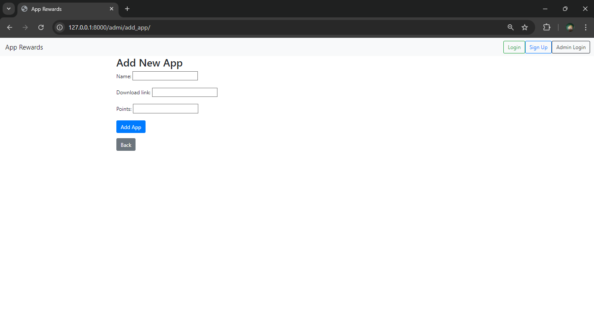

# App Rewards
## Overview

This Django project is a platform where users can earn points by downloading Android apps. Admins can manage the list of apps, and users can sign up, log in, download apps, and submit screenshots to confirm task completion. Points are awarded based on the tasks completed by the users.

## Features

- **Admin Panel:**
  - Login with predefined credentials.
  - Add, update, and delete Android apps.
  - View the list of all apps.

- **User Panel:**
  - Sign up and log in.
  - View available apps with download links and points.
  - Submit a screenshot to confirm task completion.
  - View profile with total points earned and task history.

## Predefined Admin Credentials

- **Username:** `admin`
- **Password:** `pass`


## Technology Stack

- **Backend**: Django (Python)
- **Frontend**: Bootstrap (HTML, CSS)
- **Database**: SQLITE3

## Installation

### Prerequisites

- Python 3.11
- Django==5.1.1
- pillow==10.4.0


### Step-by-Step Guide

1. **Clone the Repository**:
   ```bash
   git clone git@gitlab.com:next-growth-labs1/reward_project.git
   cd reward_project
   ```

2. **Create a Virtual Environment**:
    ```bash
    python3 -m venv venv
   venv\Scripts\activate  # On Windows use 
    ```

3. **Install the Required Python Packages**:
    ```bash
    pip install -r requirements.txt
    ```

4. **Navigate to the working directory**:
    ```bash
    cd ProblemSet2_Functional_web_app
    cd reward_project      
    ```    

5. **Perform migration command**:
    ```bash
    python manage.py makemigrations
    python manage.py migrate
    ```

6. **Start the Development Server**:
    ```bash
    python manage.py runserver
    ```

## Usage

### Admin Panel Usage

As an admin, you can manage the list of Android apps that users can download and earn points from. Below are the key actions you can perform:

1. **Admin Login**
   - Navigate to `http://127.0.0.1:8000/admi/login/`.
   - Use the predefined credentials:
     - **Username:** `admin`
     - **Password:** `pass`
   - Upon successful login, you'll be redirected to the **Admin Dashboard**.

2. **Admin Dashboard**
   - After logging in, you'll see a list of all the apps currently available for users.
   - Each app has the following options:
     - **Update**: Allows you to modify the app details (name, download link, points).
     - **Delete**: Permanently removes the app from the platform.

3. **Add New App**
   - Click the "Add App" button in the Admin Dashboard.
   - Fill out the following fields:
     - **App Name**: The name of the Android app.
     - **Download Link**: A direct link to download the app from Google Play or another source.
     - **Points**: The number of points users will earn for downloading the app and submitting proof (a screenshot).
   - Click "Submit" to add the app, and it will appear in both the admin panel and the user dashboard.

4. **Logout**
   - To log out of the admin panel, click the "Logout" button in the top-right corner.
   - You'll be redirected to the admin login page.

### User Panel Usage

As a user, you can sign up, log in, view available apps, download them, and earn points by submitting screenshots to confirm task completion.

1. **User Sign Up**
   - Go to `http://127.0.0.1:8000/`.
   - Fill in the registration form with your username, email, and password.
   - After successful sign-up, you will be automatically logged in and redirected to the **User Dashboard**.

2. **User Login**
   - If you already have an account, go to `http://127.0.0.1:8000/login/` to log in.
   - Enter your username and password to access your account and be redirected to the **User Dashboard**.

3. **User Dashboard**
   - The user dashboard lists all the apps that the admin has added, including the download link and the number of points you can earn.
   - You can click the **Download** button next to any app to download it directly from the provided link.

4. **Submit Task (Screenshot)**
   - After downloading an app, return to the dashboard and click on the **Submit Screenshot** button next to the app you downloaded.
   - You'll be redirected to the **Submit Task** page where you can upload a screenshot to verify that you've downloaded and opened the app.
   - Use the drag-and-drop interface or click to upload the screenshot.
   - After uploading, click "Submit" to complete the task. The app points will be added to your total points.

5. **User Profile**
   - Click on your username in the top-right corner to access your **User Profile**.
   - In the profile, you can view:
     - **Your Basic Information** (username, email).
     - **Total Points Earned**: Sum of points from all completed tasks.
     - **Task History**: A list of all the apps you’ve completed, along with the points earned from each task.

6. **User Logout**
   - You can log out at any time by clicking the **Logout** button in the navigation bar.

### Admin vs. User Panel

- **Admin Panel**: Exclusively for managing apps, and only accessible to predefined admin users.
- **User Panel**: Accessible to anyone who signs up, allowing them to earn points by completing tasks.

### Points System

- Every app in the system has a number of points associated with it.
- Once a user submits a screenshot to confirm that they've downloaded an app, the points for that app are automatically added to their account.
- The total points can be viewed on the user’s profile page.

### Task Completion

- After downloading an app, users submit a screenshot as proof.
- The screenshot serves as confirmation that the user has indeed downloaded and opened the app.

## URLs Configuration

The `urls.py` file in a Django project is responsible for routing incoming requests to the appropriate views. This file maps URLs to their corresponding views, allowing different pages and functionalities to be accessible by users and admins.

### Overview of URLs

In this project, we have separate routes for the **admin panel** and the **user panel**. Below is a breakdown of the URLs and their usage.

### Key URL Routes

1. **Admin Routes**
   - **Login**: `/admi/login/`
   - **Logout**: `/admi/logout/`
   - **Dashboard**: `/admi/dashboard/`
   - **Add App**: `/admi/add_app/`
   - **Update App**: `/admi/update_app/<int:app_id>/`
   - **Delete App**: `/admi/delete_app/<int:app_id>/`

2. **User Routes**
   - **Sign Up**: `/`
   - **Login**: `/login/`
   - **Logout**: `/logout/`
   - **Dashboard**: `/dashboard/`
   - **Submit Task (Screenshot)**: `/submit_task/<int:app_id>/`
   - **Profile**: `/profile/`

## Screenshots
**Figure 1: Signup Page**
 

**Figure 2: Login Page**
 

**Figure 3: Admin Login Page**
 

**Figure 4: Admin Dashboard Page**
 

**Figure 5: Add App Page**
 

**Figure 6: Update App Page**
 

**Figure 7: User Dashboard Page**
 

**Figure 8: Submit ScreenShot Page**
 

**Figure 9: User Profile Page**
 